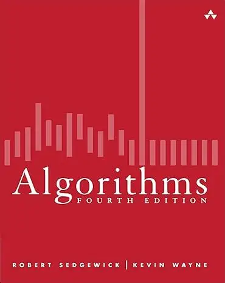
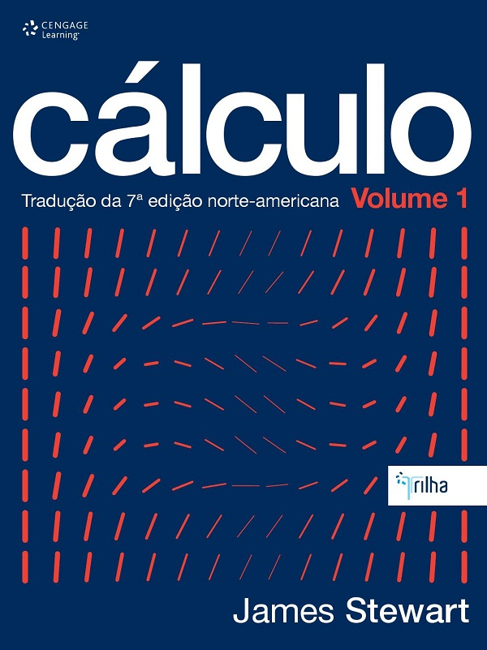
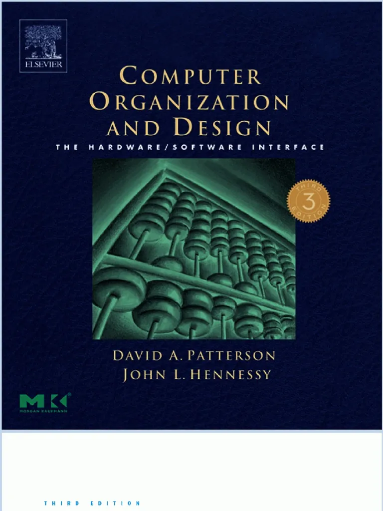

.gif>)

---
## Sections

- [🙋‍♂️About Me](#about-me)
- [🧠 Skills](#skills)
- [🏋🏻‍♂️Learning](#learning)
- [Contact](#contact)

---

## 🙋‍♂️About Me

Student of Ciency of Computation (2 Semester)
Student of Software Engineer (3 Semester)
Trying to learn other languages
Enthusiast of Low-level Systens and ML
In my free time, I play chess and read manga

---

## 🧠 Skills

C            ███████░░░ 7/10  
Java         ███████░░░ 7/10  
C++          ██████░░░░ 6/10  
Python       ████████░░ 8/10  
JavaScript   █████░░░░░ 5/10  
HTML         ████░░░░░░ 4/10  
CSS          ████░░░░░░ 4/10  
Arduino      █████████░ 9/10  

### 🐝 Beecrown:https://judge.beecrowd.com/pt/profile/1229681
---

## 🏋🏻‍♂️Learning

- Data Structures
- Computer Architecture
- Software Engeenering 
- English
- Calculus

---

### 📗Reading

  
  
  
  
  
  
  

---

## 📞Contact

Email: ian.souza@sga.pucminas.br
Discord: minedfish1
